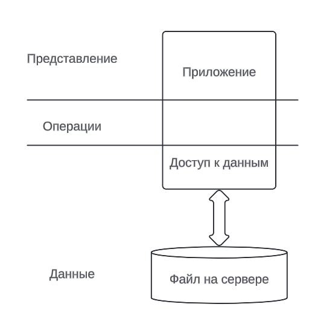
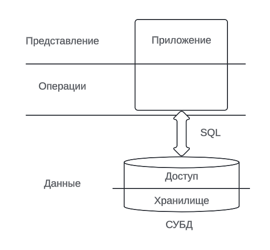

# Базы данных

## Введение

Курс базы данных находится в цикле курсов "Управление данными" на направлении ИС

В отличие от математиков, перед которыми не стоят как таковые ограничения, у инженеров существуют ограничения, будь-то
бюджет или время. Поэтому инженеры вынуждены искать компромиссы между тремя главными параметрами: надежность,
производительность и безопасность.

В XX веке был сформулирован закон Мура, который прогнозировал увеличение числа транзисторов в два раза каждые два года,
но в 10-ых годах закон Мура перестал работать из-за физических ограничений. Далее появилось большое желание увеличивать
память, в следствие чего появились распределенные системы, но ограничениями
стала [теорема CAP](https://ru.wikipedia.org/wiki/%D0%A2%D0%B5%D0%BE%D1%80%D0%B5%D0%BC%D0%B0_CAP)

Британский учёный [Эдгар Кодд](https://ru.wikipedia.org/wiki/%D0%9A%D0%BE%D0%B4%D0%B4,_%D0%AD%D0%B4%D0%B3%D0%B0%D1%80) в
70-ых сформулировал основы теории **реляционных баз данных**, на основе которой созданы современные реляционные базы
данных

## Лекция 1

Выделяют 5 информационных процессов:

* Сбор
* Обработка
* Хранение
* Передача
* Представление

И эти процессы хотелось бы автоматизировать

До появления Computer Science как науки все эти процессы существовали в пределах небольших библиотеки, в которых книги
искались линейным или двоичным поисками. После этого библиотеки увеличивались, появились картотеки, каталоги.

Тем не менее определение информации так и не сформулировалось по многим философским вопросам: что такое информация?
Является ли информация атрибутом материи или энергии? Существует ли информация без человека? Поэтому информацию следует
воспринимать как триединство сигнала, данных и знаний.

В начале XX века Гёдель, целью которого была создать систему доказательств в математике, и, следовательно,
автоматизировать их, изобрел систему представления математических доказательств и доказал, что такая система не может
быть
полной ([теорема о неполноте](https://ru.wikipedia.org/wiki/%D0%A2%D0%B5%D0%BE%D1%80%D0%B5%D0%BC%D1%8B_%D0%93%D1%91%D0%B4%D0%B5%D0%BB%D1%8F_%D0%BE_%D0%BD%D0%B5%D0%BF%D0%BE%D0%BB%D0%BD%D0%BE%D1%82%D0%B5))

После Гёделя появился Джон фон Нейман, целью которого была представить информацию в конечном пространстве. Из этой идеи
вывелась архитектура фон Неймана, где числа представлялись в двоичном виде. В итоге получается, что данные - это
информация, которая закодирована заранее обговоренным способом:

> **Данные** (ISO / IEC 2382:2015) - поддающееся многократной интерпретации представление информации в формализованном
> виде, пригодном для передачи, интерпретации или обработке

Из этого появляется потребность моделировать данные. Но у моделей появляются свои ограничения. Приведем пример таблицы
студентов:

| Студент | Группа | Дисциплина | Преподаватель | Аудитория | Время |
|---------|--------|------------|---------------|-----------|-------|
|         |        |            |               |           |       |
|         |        |            |               |           |       |

Поиск конкретного студента реализовать легко, но что если нам нужно иметь в виду несколько дисциплин для одного
студента? Приходит другая реализация:

| Студент | Группа | (Дисциплина1, ...) | (Дисциплина2, ...) |
|---------|--------|--------------------|--------------------|
|         |        |                    |                    |
|         |        |                    |                    |

Но в ней мы не сможем запросто составить расписание для какого-то преподавателя. Тогда приходит идея разделить на
несколько табличек для студентов:

| Номер студента | ФИО студента |
|----------------|--------------|
|                |              |

Для групп:

| Номер группы | Факультет группы |
|--------------|------------------|
|              |                  |

И для предметов:

| Номер дисциплины | Название дисциплины | Преподаватель |
|------------------|---------------------|---------------|
|                  |                     |               |

В этом случае повышается целостность данных, но уменьшается производительность системы, и в итоге мы не сможем найти
идеального решения
## Лекция 2

Откуда появилась идея абстрагирования данных? Сначала все началось с архитектуры фон Неймана, где появилась однородность памяти - концепция хранения данных и инструкций в одном месте. Потом появилась первая абстракция данных - хранение в файле. Если же в оперативной памяти читаемость не нужна, то в постоянной она необходима для упрощенной работы - будь-то имя файла и имя каталога. И так появляется файло-серверная архитектура:

Все хорошо, но что, если приложений будет N? Каждое из них будет блокировать этот файл, таким образом можно соблюдать целостность данных, но файл становиться большим и нельзя поддерживать параллельный доступ (эффект конкурентных транзакций), падает производительность

Можно хранить несколько файлов, каждый из них хранящий группу данных (например: студенты, группы, факультеты), но все равно почти все запросы запрашивают те комбинации файлов, которые так или иначе пересекутся

Можно воспользоваться позиционированием - разбиением данных на группы (студентов на факультеты), но возникают другие проблемы: студенты мигрируют между факультетами, другие студенты ходят на занятия других факультетов

При этом данные растут, а если фрагментировать данные, то придется переписывать логику кода, что не является хорошей идеей. Да и к тому же возникает противоречие скоростей записи и чтения: нельзя обеспечить одинаково быстрые запись и чтение

В итоге появляется клиент-серверная архитектура, появляется СУБД (**Система Управления Базой Данных**) и моделирование данных, из-за чего мы избавляемся от привязанности к определенному формату файла

Появляется целостность данных, которая контролируется СУБД, и повышается производительность в следствие группировки запросов по времени и другим параметрам. Появляются правила моделирование бизнес-сущностей.

Но в чем состоит идея моделирования: выделение значимых аспектов у сущностей и для разных целей формирование различного моделирования

Выделяют 2 основания классификаций:

1. Трехуровневая архитектура (ANSI/SPARC):
- Внешний 
- Концептуальный
- Внутренний (физический, исходный)

_Внешний уровень_ определяет базу данных с точки зрения конечного пользователя, например: для студофиса важно знать возраст определенного студента, но хранить возраст не удобно

_Концептуальный уровень_ - на этом уровне накладываются ограничения на данные, определяются сущности и атрибуты, семантика данных (например: рейтинг компании на внешнем уровне может быть Excellent, Good, ..., а на концептуальном 5, 4, ... для упрощенной группировки)

_Внутренний уровень_ - то, что организует производительность, безопасность, структуру файлов, шифрование и ограниченный доступ к щекотливым данным

2. И уровни моделей данных

- Сущность-связь
- Логический (дата-логический) уровень
- Физический уровень

Сущность-связь (ER, Entity-Relation) - абстрагирование объектов, появление связей

Логический уровень - то, как мы пытаемся описать сущность-связь, выделив какие-то формальные множества

Физический уровень - выбор СУБД на основе логического уровня (ограничения на типы данных, производительность, безопасность)

В конце концов появляется вот такой граф:

Сущность - множество экземпляров, реальных или абстрактных, однотипных объектов предметной области

Выделяют 2 типа сущности: сильная и слабая

Студент - сильная сущность, потому что может существовать без других

Группа - слабая сущность, потому что не может существовать без студентов (но группа может быть и сильной сущностью)

Также у сущностей могут быть атрибуты

- Составные, например, ФИО
- Простые, например, Фамилия и Имя по отдельности

А также:

- Однозначными - хранят одно значение, например, телефон
- Многозначными - хранят не меньше одного значения, например, контакт, хранящий JSON-объект с множеством телефонов

Появляются 3 вида связи:

* One-To-One: студент `-<>-` паспорт (1 `<->` 1) (паспорт можно выделить в отдельную сущность, чтобы ограничить к нему доступ)

* One-To-Many: группа `-<>-` студент (1 `<->` N)

* Many-To-Many: группы `-<>-` студенты (M `<->` N)

Получается такая картинка в нотации Чена:

